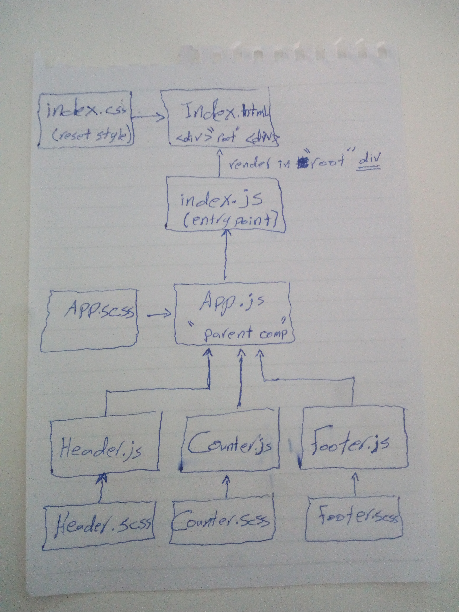

# LAB - Class 26

### Author: Ayman Khawaldeh

### Links and Resources

- [submission PR]()

### Setup
npm i react enzyme gh-pages node-sass

#### How to initialize/run your application (where applicable)

- `npm run test`
- `npm run start`

     
### Work as groub : Mhummad-Alhawamdeh  Ayman-al-kwaldeh
#### UML
Link to an image of the UML for your application and response to events

